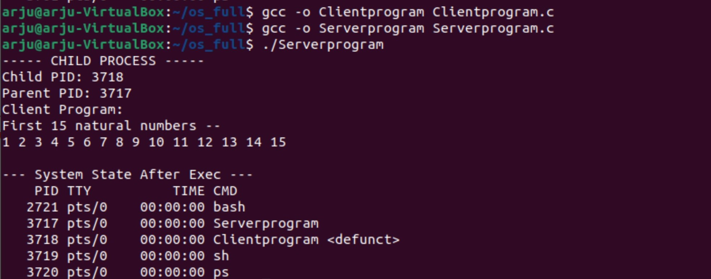

# Exec 

exec is a functionality of an operating system that runs an executable file in the context of an already existing process, replacing the previous executable. 
This act is also referred to as an overlay. It is especially important in Unix-like systems, although it exists elsewhere. 
As no new process is created, the process identifier (PID) does not change, but the machine code, data, heap, and stack of the process are replaced by those of the new program.  

The exec call is available for many programming languages including compilable languages and some scripting languages. 
In OS command interpreters, the exec built-in command replaces the shell process with the specified program.

#### Objective
1. Write a program to fork a child process using fork() command. Child process must execute ps system call and display its process id and parent process id.
2. Write two programs serverprogram.c and clientprogram.c and compile them separately as serverprogram and clientprogram respectively.  

Clientprogram.c must print the n numbers.  
Serverprogram.c must fork a child process which should execute the clientprogram using exec command.

#### Output

