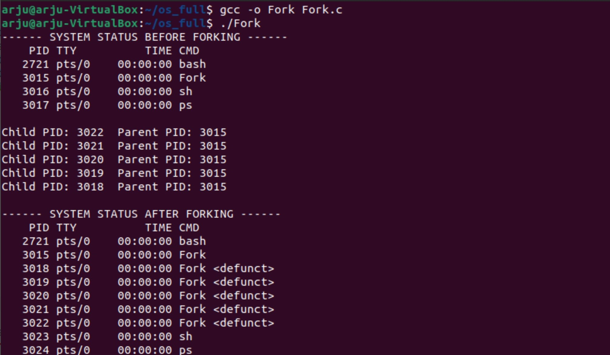

# Fork
fork() is how Unix starts new processes. Basically, how it works is this: the parent process (the one that already exists) fork()'s
a child process (the new one). The child process gets a copy of the parent's data. Now, You have two
processes where there was only one.  
This folder includes a C program that uses the concept of Fork. It includes:
1. Use system command to execute ps command to get all the processes under the current user system (“ps”).  
  #include <stdlib.h>  
  status = system(command)
2. Create 5 children using fork.
3. Use getpid() and getppid() to get the program process (child) and parent process ids.  
  #include <unistd.h>  
  pid_t getpid(void)
4. Check if the program process id and parent process ids are listed in the ps command.  

#### Output

  
