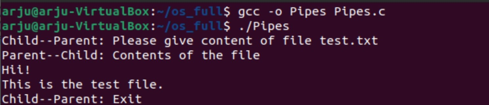

# Pipes

Prerequisites: Understand fork(), wait() and pipes.

#### Objective
Write a program to create two pipes for two way communication.  
Fork a child process and exchange the following messages between parent and child.  
Child--Parent Mesg1: Please give content of file test.txt  
Parent reads the file name and checks it is valid and reads the content.  
Parent--Child Mesg2: Contents of the file  
Child--Parent Mesg3: Exit  
Parent must wait for the child to exit.  
Parent exits after getting message and signal from the wait signal call.

#### Output

